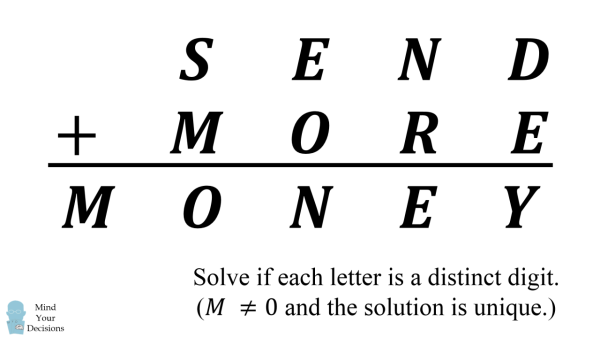

### Solving cryptarithmetic problems in Racket

This is just a simple library to solve simple cryptarithmetic problems. 

You just call a single function `solve`. 

For example to solve this: 



You'd just have to call the `solve` function like so:

```racket 
(solve '(S E N D)
       '(M O R E)
       '(M O N E Y))
```

This returns a (lazy) stream of solutions: 

```racket
#<stream>
```

Most *good* crytarithmetic problems usually have a unique solution. 

To get a solution just use the standard `racket/stream` functions: 


```racket 
(define s
  (solve '(S E N D)
         '(M O R E)
         '(M O N E Y)))
         
(stream-first s)
```
And sure enough, you'd get: 

```racket 
'((M . 1)
  (N . 6)
  (O . 0)
  (Y . 2)
  (D . 7)
  (E . 5)
  (R . 8)
  (S . 9))
```
If a particular crytparithmetic problem doesn't have a solution and you 
try to apply `stream-first` to the stream you'd get an exception saying 
it expected a non-empty stream:

```racket
stream-first: contract violation
  expected: (and/c stream? (not/c stream-empty?))
  given: #<stream>   
```

Note that it might take a while to get a solution because it searches
for a solution using a very large search tree. It returns immediately it finds a 
solution, so you don't search the whole tree (that's why it uses a `stream`).
So it depends of how far the solution is in the search tree.

If it so happens that a particular cryptarithmetic problem has more than 
one solution, and you want to get all of them, you can use the function 
`stream->list` from `racket/stream` to do that. Note that this might
take a while, as it performs an exhaustive search.

### How does this work? 

In short (using Haskell):

```haskell 
solve = filter corect . generate 
```
A solution is a finite mapping from letters to numbers.

`generate` is a function that lazily generates all posible combinations 
of a solution. It uses an implicit DFS (depth first search) implemented with natural recursion. 

`correct` takes a solution and 3 lists of letters (top row, bottom row, and result.)
It then checks to see if the top row and the bottom row *add up* to the result, using 
the given solution.

`filter` just filters the stream of solutions using `correct` as its predicate.

Here's `correct`:

```racket
(define (correct table top bot sol)
  (define (l->i letters) (letters->integer table letters))
  (eqv? (+ (l->i top) (l->i bot))
        (l->i sol)))
```
Here's `generate`: 

```racket
(define (generate rng letters)
  (match letters
    ['() (stream empty)]
    [(cons letter letters)
     (for*/stream ([index (in-list rng)]
                   [result (in-stream (generate (remove index rng)
                                                letters))])
       (cons (cons letter index)
             result))]))
```
Here's `solve`: 

```racket
(define (solve top bot sol)
  (for*/stream ([letters (in-value (set->list (apply set (append top bot sol))))]
                [solution (in-stream (generate (range 0 10) letters))]
                #:when (and (correct (make-immutable-hash solution) top bot sol)
                            (for/and ([l (for/list ([e (list top bot sol)])
                                           (first e))])
                              (not (eqv? (dict-ref solution l) 0)))))
    solution))
```

You can see the [`crypt.rkt`](https://github.com/ebresafegaga/cryptarith/blob/main/crypt.rkt) file for more details. It's 
documented *fairly* well.
