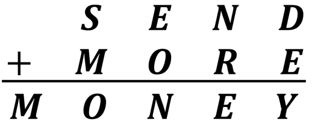

### Solving cryptarithmetic problems in Racket

This is just a simple library to solve simple cryptarithmetic problems. 

You just call a single function `solve`. 

For example to solve this: 



You'd just have to call the `solve` function like so:

```racket 
(solve '(S E N D)
       '(M O R E)
       '(M O N E Y))
```

This returns a (lazy) stream of solutions: 

```racket
#<stream>
```

Most *good* crytarithmetic problems usually have a single solution. 

To get a solution just use the standard `racket/stream` functions: 


```racket 
(define s
  (solve '(S E N D)
         '(M O R E)
         '(M O N E Y)))
         
(stream-first s)
```
And sure enough, you'd get: 

```racket 
'((M . 1)
  (N . 6)
  (O . 0)
  (Y . 2)
  (D . 7)
  (E . 5)
  (R . 8)
  (S . 9))
```
If a particular crytparithmetic problem doesn't have a solution and you 
try to invoke `stream-first` on its stream you'd get an exception saying 
you it expected a non-empty stream:

```racket
stream-first: contract violation
  expected: (and/c stream? (not/c stream-empty?))
  given: #<stream>
```

Note that it might take a while to get a solution because it searches
for a solution and returns the first it finds and stops seraching.

if 


